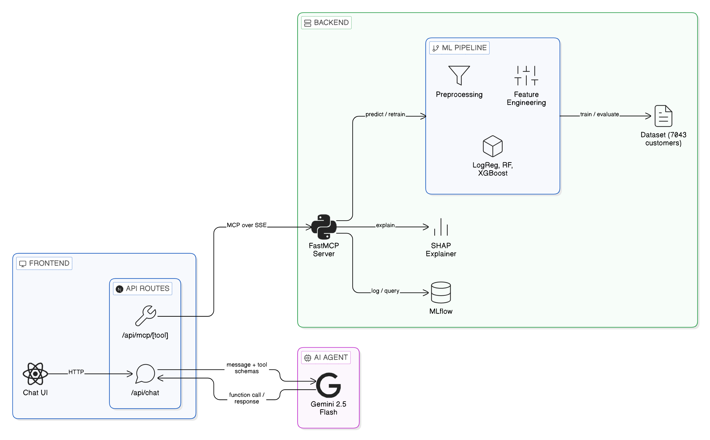

# Agentic Churn Intelligence — MCP-Powered MLOps System with LLM Tooling

An end-to-end machine learning system for telecom customer churn prediction, built around the **Model Context Protocol (MCP)**. An LLM agent (Gemini) interacts with the ML backend through structured tool calls — predicting churn, explaining predictions with SHAP, comparing models, inspecting data, and triggering retraining. The system integrates experiment tracking (MLflow), data versioning (DVC), a reproducible training pipeline, and a chat-based web client.

---

## Architecture



---

## System Capabilities

The MCP server exposes **10 tools** that an LLM agent can invoke:

| Tool | What It Does |
|------|-------------|
| `predict_churn` | Predict churn probability for a customer. All 19 features are optional, unspecified ones use dataset defaults (mode/median from the training set). Returns probability, risk level, and top SHAP drivers. |
| `explain_prediction` | Full SHAP breakdown for a single prediction; per-feature contributions, base value, top positive/negative drivers. |
| `get_model_metrics` | Performance metrics for a specific model (accuracy, precision, recall, F1, ROC-AUC). |
| `compare_models` | Leaderboard of all trained models, ranked by F1 score. |
| `get_dataset_summary` | Dataset statistics like row count, churn rate, feature distributions, class balance. |
| `get_feature_importance` | Global SHAP feature importance rankings across all customers. |
| `retrain_model` | Triggers full retraining pipeline, trains 3 models, selects best, logs to MLflow. Thread-safe (one retrain at a time). |
| `add_customer_record` | Append a validated customer record to the dataset. |
| `get_active_model_info` | Info about the deployed model name, metrics, training time, dataset size. |
| `system_status` | Platform health check: model loaded, SHAP ready, data available, retrain lock status, uptime. |

---

## Web Client

The system includes a **Next.js web interface** where users interact through a chat UI:

- **Stack**: Next.js (App Router) · TypeScript · Tailwind CSS · shadcn/ui
- **AI Agent**: Gemini 2.5 Flash with function calling
- **Flow**: User asks a question → Gemini decides which MCP tool(s) to call → Next.js API routes bridge the call to the MCP server via SSE → result flows back through Gemini → natural language answer displayed in chat
- **Sidebar dashboard**: Live system status, model leaderboard, dataset summary, and a tools reference panel showing all available MCP tools with their parameters

The frontend and backend are fully independent services. The web client communicates with the MCP server exclusively through SSE transport.

---

## What is MCP?

**Model Context Protocol** is an open standard (by Anthropic) that allows LLMs to call external tools and services through a structured interface. Instead of building custom API integrations, MCP provides a universal protocol, the LLM sees typed tool schemas, decides which tool to call, fills parameters, and receives structured results. This system uses MCP with SSE (Server-Sent Events) transport over HTTP.

---

## Architecture Overview

The system follows a **hexagonal architecture** (ports and adapters) with three layers:

**Frontend** — Next.js web client with chat interface. API routes act as the MCP bridge. Gemini handles natural language ↔ tool call translation.

**MCP Server** — FastMCP with SSE transport (port 8000). Thin routing layer — validates inputs, calls core services, serializes responses. 10 tools exposed.

**Core ML** — All machine learning logic, isolated from how it's served:
- `core/data/` — Data loading, validation (Pydantic), preprocessing (OneHotEncoder + StandardScaler)
- `core/features/` — Feature engineering: tenure groups, charge ratios, service counts, interaction features (19 raw → 25 engineered → 39 after encoding)
- `core/models/` — Model training (Logistic Regression, Random Forest, XGBoost), selection by F1 score, MLflow logging
- `core/explainability/` — SHAP TreeExplainer for per-prediction and global feature importance
- `services/pipelines/` — Training pipeline orchestrator (ingest → engineer → train → evaluate)

**Infrastructure** — MLflow (experiment tracking + model registry), DVC (dataset versioning + reproducible pipeline), Docker (backend containerization).

---

## Technology Stack

| Layer | Technology | Role |
|-------|-----------|------|
| Frontend | Next.js · TypeScript · Tailwind · shadcn/ui | Chat UI + MCP bridge |
| AI Agent | Gemini 2.5 Flash | Function calling, natural language synthesis |
| Agent Protocol | FastMCP (SSE transport) | LLM ↔ ML backend communication |
| ML Models | scikit-learn · XGBoost | Logistic Regression, Random Forest, XGBoost |
| Explainability | SHAP | Per-prediction + global feature importance |
| Experiment Tracking | MLflow | Params, metrics, artifacts, model registry |
| Data Versioning | DVC | Reproducible pipeline, dataset tracking |
| Validation | Pydantic | Type-safe schemas at data boundaries |
| Containerization | Docker | Backend deployment |
| Runtime | Python 3.12 · uv | Dependency management |
| Testing | pytest | Schema, model, and MCP integration tests |

---

## Quick Start

### Backend

```bash
# Install dependencies (requires Python 3.12 and uv)
uv sync

# Train all models
uv run python main.py train

# Start MCP server (SSE transport, port 8000)
uv run python main.py serve

# Run tests
uv run pytest tests/ -v
```

### Frontend

```bash
cd frontend

# Install dependencies
npm install

# Set environment variables
cp .env.example .env.local
# Add your GEMINI_API_KEY to .env.local

# Start development server
npm run dev
```

### Connecting AI Agents

**Gemini (via web client):** Start both servers — the web client handles everything.

**Claude Desktop (stdio transport):**
```json
{
  "mcpServers": {
    "churn-intelligence": {
      "command": "uv",
      "args": ["run", "python", "main.py", "serve", "--transport", "stdio"],
      "cwd": "/path/to/MCP_ops"
    }
  }
}
```

---

## Project Structure

```
├── main.py                          # CLI entry point (train / serve)
├── params.yaml                      # ML hyperparameters (DVC-tracked)
├── dvc.yaml                         # 4-stage pipeline definition
├── Dockerfile                       # Backend container
│
├── src/
│   ├── config/settings.py           # Config: params.yaml + env vars
│   ├── core/
│   │   ├── data/
│   │   │   ├── loader.py            # Data ingestion + cleaning
│   │   │   ├── validator.py         # Pydantic row validation
│   │   │   └── preprocessor.py      # ColumnTransformer (scaler + encoder)
│   │   ├── features/engineer.py     # 6 derived features (row-level)
│   │   ├── models/
│   │   │   ├── trainer.py           # Train 3 models, log to MLflow
│   │   │   └── registry.py          # Best model selection
│   │   └── explainability/
│   │       └── shap_explainer.py    # SHAP TreeExplainer
│   ├── services/pipelines/
│   │   └── training_pipeline.py     # 4-stage orchestrator
│   ├── interfaces/mcp/server.py     # 10 MCP tools + FastMCP server
│   └── schemas/models.py            # Pydantic schemas
│
├── frontend/
│   ├── src/app/
│   │   ├── page.tsx                 # Main layout (chat + sidebar)
│   │   ├── api/chat/route.ts        # Gemini integration
│   │   └── api/mcp/[tool]/route.ts  # MCP-to-HTTP bridge
│   ├── src/components/
│   │   ├── chat-interface.tsx        # Chat UI with message bubbles
│   │   └── sidebar.tsx              # Dashboard: tools, status, models, data
│   └── src/lib/
│       ├── mcp-tools.ts             # 10 tool declarations for Gemini
│       └── types.ts                 # TypeScript interfaces
│
├── tests/                           # pytest: schemas, models, MCP tools
├── data/raw/churn.csv               # Telco Customer Churn dataset (DVC-tracked)
├── models/                          # Trained artifacts (pkl, metrics, plots)
└── tracking/mlflow.db               # MLflow SQLite backend
```

---

## Experiments

MLflow tracks every training run — parameters, metrics, confusion matrices, ROC curves, and feature importance plots.

```bash
uv run mlflow ui --backend-store-uri sqlite:///tracking/mlflow.db
# Open http://localhost:5000
```

Latest results (Telco Churn — 7,043 records, 26.5% churn rate):

| Model | F1 | ROC-AUC | Precision | Recall |
|-------|-----|---------|-----------|--------|
| Logistic Regression | 0.615 | 0.847 | 0.500 | 0.799 |
| **Random Forest** | **0.622** | **0.843** | **0.544** | **0.725** |
| XGBoost | 0.611 | 0.830 | 0.544 | 0.698 |

Best model auto-selected by F1 score. Class imbalance handled via balanced weights.

---

## DVC Pipeline

```bash
# Reproduce full pipeline
dvc repro

# View pipeline DAG
dvc dag
```

Four stages: `ingest → feature_engineering → train → evaluate`. Parameters in `params.yaml`, data tracked via `.dvc` pointer files.
